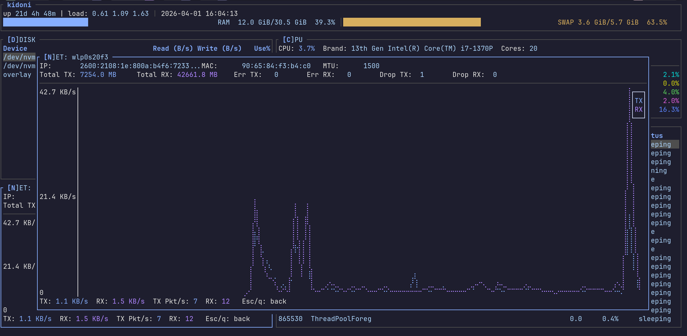
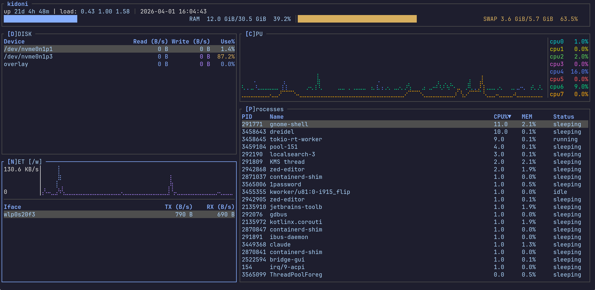

# dreidel

**A fast, keyboard-driven terminal system monitor.**


---

## Screenshots





---

## Overview

dreidel is a terminal UI system monitor that gives you a live view
of your machine at a glance:

- **CPU** — per-core line charts with scrollable history
- **Network** — per-interface RX/TX rates; press `Enter` on any
  interface for a full-screen graph of just that interface
- **Disk** — per-device read/write rates and usage percentage;
  same per-device detail view
- **Process** — sortable, filterable process table with a detail
  overlay and kill support
- **Status bar** — clock, uptime, load averages, and RAM/swap gauges

Everything is navigable by keyboard, customisable via a config
file or CLI flags, and designed to stay out of your way.

For a full reference of every feature, keybinding, and
configuration option, see the **[User Guide](USER_GUIDE.md)**.

---

## Installation

### From source

Requires a recent stable [Rust toolchain](https://rustup.rs)
(1.88 or later).

```sh
git clone https://github.com/raysuliteanu/dreidel
cd dreidel
cargo build --release
./target/release/dreidel
```

### cargo install

```sh
cargo install dreidel
```

### cargo binstall

_`cargo binstall` support coming once pre-built release binaries
are available._

---

## Quick Start

```sh
dreidel               # launch with defaults
dreidel --help        # see all CLI options
```

### Basic navigation

| Key         | Action                                    |
| ----------- | ----------------------------------------- |
| `c`         | Focus CPU panel                           |
| `n`         | Focus Network panel                       |
| `d`         | Focus Disk panel                          |
| `p`         | Focus Process panel                       |
| `Tab`       | Cycle focus through visible panels        |
| `f`         | Toggle fullscreen for the focused panel   |
| `Enter`     | Open detail view (Network, Disk, Process) |
| `?`         | Show help overlay                         |
| `q` / `Esc` | Quit (or exit fullscreen / close overlay) |

### Things worth trying

- **Per-interface network graph:** Focus Network (`n`), highlight
  an interface with `↑`/`↓`, press `Enter`. You get a full-screen
  scrolling graph of just that interface's TX and RX. Press `Esc`
  to go back.
- **Per-device disk graph:** Same idea — focus Disk (`d`), select
  a device, press `Enter`.
- **Process detail:** Focus Process (`p`), navigate to any row,
  press `Enter` for a full-field breakdown (PID, user, memory,
  threads, I/O, etc.).
- **Filter processes:** While in the Process panel, press `/` and
  start typing. The list narrows in real time. `Esc` clears the
  filter.
- **Sort processes:** Press `s` to cycle sort columns, `S` to
  reverse direction.
- **Extended process columns:** Make the terminal ≥ 120 columns
  wide (or press `f` for fullscreen) to see the full htop-style
  column set: User, PR, NI, VIRT, RES, SHR, Time, Command.

---

## Layouts

Select with `--preset <NAME>` or `layout.preset` in the config
file.

| Preset                | Description                                                        |
| --------------------- | ------------------------------------------------------------------ |
| `sidebar` _(default)_ | Narrow left column (CPU, Net, Disk) beside a tall process list     |
| `classic`             | CPU top-left, Disk/Net stacked top-right, Process fills the bottom |
| `dashboard`           | CPU strip across the top, Disk + Net side-by-side, Process below   |
| `grid`                | Disk + Net stacked left, CPU + Process stacked right               |

---

## Themes

| Value            | Behavior                                                                       |
| ---------------- | ------------------------------------------------------------------------------ |
| `auto` (default) | Detects light/dark from the terminal background on startup; falls back to dark |
| `dark`           | Dark background, vivid colors                                                  |
| `light`          | Light background, muted colors optimized for contrast                          |

```sh
dreidel --theme dark
dreidel --theme light
```

---

## Configuration

dreidel reads `~/.config/dreidel/config.toml` on startup. All
fields are optional.

```sh
dreidel --init-config > ~/.config/dreidel/config.toml
```

A minimal example:

```toml
[general]
refresh_rate = "500ms"
theme = "dark"

[layout]
preset = "dashboard"

[process]
default_sort = "cpu"
default_sort_dir = "desc"

[keybindings]
help = "h"   # prefer h over ? for the help overlay
```

See the **[User Guide](USER_GUIDE.md)** for the complete
configuration reference, all layout slot overrides, and keybinding
options.

---

## Further Reading

- **[User Guide](USER_GUIDE.md)** — complete reference: all
  components, keyboard shortcuts, fullscreen behavior, layouts,
  themes, CLI flags, and config options
- **[ARCHITECTURE.md](ARCHITECTURE.md)** — technical deep-dive
  into the data flow, component model, and layout engine
- **[BUILDING.md](BUILDING.md)** — build, test, and release
  instructions

---

## Contributing

Contributions are welcome!

- **Bug reports and feature requests** — please
  [open an issue](https://github.com/raysuliteanu/dreidel/issues)
- **Code contributions** — fork the repository, create a branch,
  and open a pull request

<https://github.com/raysuliteanu/dreidel>
