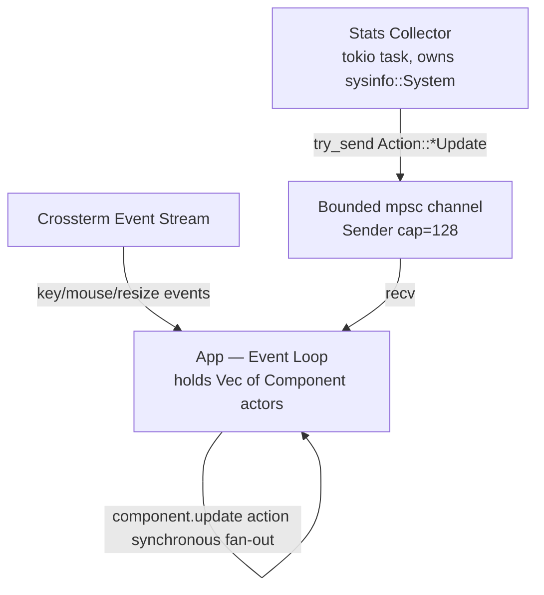
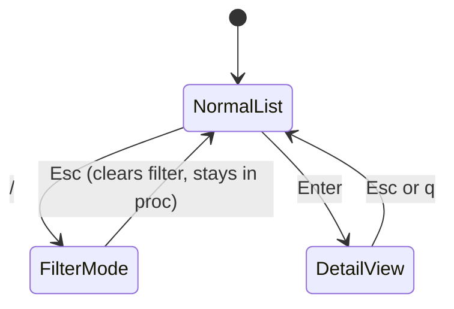

# toppers — Design Specification

**Date:** 2026-03-25
**Status:** Draft

## Overview

`toppers` is a modern, keyboard-friendly terminal user interface (TUI) system monitor for Linux and macOS, inspired by `bpytop`. It is built in Rust using the `ratatui` crate and a component-actor architecture. It displays CPU, memory, network, disk I/O, and process information in a configurable, multi-panel layout with full keyboard navigation.

---

## Goals

- Provide a `bpytop`-style TUI system monitor with a clean, modern look
- Support light, dark, and auto (system-detected) themes
- Be fully keyboard-driven with discoverable shortcuts
- Allow flexible layout configuration via a TOML config file and CLI overrides
- Be extensible: each component is an independent actor communicating over channels

---

## Non-Goals

- Windows support
- Mouse interaction (keyboard-only)
- Remote monitoring (local system only)
- Plugin system

---

## Platform Support

| Platform | Support |
|---|---|
| Linux | Full, including temperature sensors and swap activity rates |
| macOS | Full, excluding temperature and swap-in/out rates |

Linux-only features are gated with `#[cfg(target_os = "linux")]`.

**macOS temperature exclusion rationale:** `sysinfo` exposes thermal data on macOS via IOKit/SMC, but access requires elevated permissions on some hardware configurations and thermal zone naming is inconsistent across Apple silicon and Intel Macs. Temperature is therefore Linux-only for v1; macOS support can be added in a future release once reliability is validated.

---

## Architecture

### Actor Model

Each component is an actor: it owns its own state and communicates exclusively via message passing. There is no shared mutable state between actors.

**Key distinction:** Components are not separate Tokio tasks. They are held in-process by `App` as `Vec<Box<dyn Component>>` and driven synchronously from the event loop via `component.update(action)`. The **Stats Collector** is the only separate Tokio task — it owns `sysinfo::System` and sends typed metric snapshots into `App`'s bounded action channel.



### Channel Design

There is a single bounded `tokio::sync::mpsc` channel. `App` is the sole receiver. The stats collector (and components that want to emit actions) hold a cloned `Sender<Action>`.

The stats collector uses `try_send()` — if the channel is full, the metric snapshot is dropped and logged at `tracing::debug!`. A missed metric frame causes a stale display for one tick, which is acceptable.

Default channel capacity: **128** (configurable via `channel_capacity` in config).

### Event Loop

`App` is the coordinator. On each iteration it:

1. Awaits the next `Event` from `Tui` (crossterm events, tick signals, render signals)
2. Translates events to `Action` variants and sends them into the channel via its own `Sender`
3. Drains the channel, calling `component.update(action)` on every component for each action
4. On `Action::Render`, calls `component.draw(frame, rect)` on each visible component with its allocated `Rect`
5. On `Action::Resize(w, h)`, recomputes layout `Rect`s and re-renders

### Terminal Resize

On `Action::Resize(w, h)`, `App` calls `tui.resize()` to update the backend, recomputes all layout `Rect`s from the new terminal dimensions, and triggers a full re-render. Components that maintain rolling history buffers (e.g., CPU sparklines) preserve their history across resize — only the rendered width changes. No component state is cleared on resize.

---

## Components

### Component Trait

All components implement the `Component` trait (extended from the sprintrs pattern). The action sender given to each component via `register_action_handler` allows a component to emit actions back into the shared channel (e.g., `ProcessComponent` sending a kill confirmation action).

```rust
pub trait Component {
    fn register_action_handler(&mut self, tx: Sender<Action>) -> Result<()>;
    fn register_config_handler(&mut self, config: Config) -> Result<()>;
    fn init(&mut self, area: Size) -> Result<()>;
    fn handle_events(&mut self, event: Option<Event>) -> Result<Option<Action>>;
    fn handle_key_event(&mut self, key: KeyEvent) -> Result<Option<Action>>;
    fn update(&mut self, action: Action) -> Result<Option<Action>>;
    fn draw(&mut self, frame: &mut Frame, area: Rect) -> Result<()>;
}
```

### Component Summary

| Component | Interactive | In Layout Slots | Notes |
|---|---|---|---|
| `StatusBarComponent` | No | No — fixed strip | hostname, uptime, time, load |
| `CpuComponent` | Minimal | Yes | per-core + aggregate, sparklines |
| `MemComponent` | No | Yes | RAM + swap bars, swap activity (Linux) |
| `NetComponent` | Scroll | Yes | per-interface tx/rx |
| `DiskComponent` | Scroll | Yes | per-device r/w throughput |
| `ProcessComponent` | Full | Yes | list, filter, sort, detail, tree |
| `DebugComponent` | No | No — right sidebar overlay | dev-only state inspector, hidden by default |

### ComponentId

Used by `App` to track focus and full-screen state:

```rust
#[derive(Debug, Clone, Copy, PartialEq, Eq, strum::Display, strum::EnumIter)]
pub enum ComponentId {
    Cpu,
    Mem,
    Net,
    Disk,
    Proc,
    // StatusBar and DebugComponent are excluded — never focusable
}
```

`EnumIter` is used by `App` to fan out focus-switch key handling and iterate over all focusable components when rebuilding the layout.

### Debug Component

`DebugComponent` is a development-aid actor that renders a right-side sidebar showing the `{:#?}` formatted state of each component actor. It is:

- **Hidden by default** in all builds — not a debug-only compile target
- **Enabled** via `--debug` CLI flag or the `` ` `` (backtick) key at runtime
- **Rendered as a sidebar overlay** on the right edge of the terminal, using `Layout::horizontal` with a `Constraint::Fill` that collapses to zero when hidden
- **Not part of the slot system** — like `StatusBarComponent`, it is allocated independently by `App`

Each component implements `Debug` (derived) so `DebugComponent` can render their state without any additional trait work. The sidebar is scrollable for large state trees.

```
┌───────────────────────────┬──────────────────┐
│   normal layout           │ [DEBUG]           │
│                           │ CpuComponent {    │
│                           │   per_core: [...] │
│                           │   aggregate: 42.1 │
│                           │ }                 │
│                           │ ProcessComponent {│
│                           │   sort: Cpu,      │
│                           │   filter: None,   │
│                           │ }                 │
└───────────────────────────┴──────────────────┘
```

### Stats Collector Actor

A Tokio task that owns a single `sysinfo::System`. Refreshes all subsystems on each tick and sends typed snapshot actions into the shared channel via `try_send()`:

```rust
Action::SysUpdate(SysSnapshot)    // hostname, uptime, load averages, current time
Action::CpuUpdate(CpuSnapshot)    // per-core %, aggregate %, freq, temp (Linux)
Action::MemUpdate(MemSnapshot)    // RAM + swap used/total, swap-in/out bytes (Linux)
Action::NetUpdate(NetSnapshot)    // per-interface tx/rx bytes/s
Action::DiskUpdate(DiskSnapshot)  // per-device read/write bytes/s, usage %
Action::ProcUpdate(ProcSnapshot)  // full process list
```

### Snapshot Types (selected)

```rust
pub struct MemSnapshot {
    pub ram_used:      u64,  // bytes
    pub ram_total:     u64,  // bytes
    pub swap_used:     u64,  // bytes
    pub swap_total:    u64,  // bytes
    #[cfg(target_os = "linux")]
    pub swap_in_bytes:  u64, // bytes swapped in from disk since last tick
    #[cfg(target_os = "linux")]
    pub swap_out_bytes: u64, // bytes swapped out to disk since last tick
}

pub struct CpuSnapshot {
    pub per_core:    Vec<f32>,    // usage % per logical core, 0.0–100.0
    pub aggregate:   f32,         // overall usage %, 0.0–100.0
    pub frequency:   Vec<u64>,    // MHz per logical core
    #[cfg(target_os = "linux")]
    pub temperature: Option<f32>, // degrees Celsius, best-effort via sysinfo
}
```

---

## Process Component

The most complex actor. Owns all process UX state.

### State Machine



Full-screen mode is managed at the `App` level, not within `ProcessComponent` — see Layout System.

### Key Event Dispatch Rule

When `ProcessComponent` is the focused component, it receives key events **before** global handlers, except for the global focus-switch keys (`p`, `c`, `m`, `n`, `d`). This means:

- `Esc` in `FilterMode` → consumed by `ProcessComponent` (clears filter), never reaches `App`
- `Esc` in `NormalList` with no active state → not consumed by component → `App` handles it (exit full-screen or quit)
- `q` in `DetailView` → consumed by component (return to list)
- `q` in `NormalList` → not consumed → `App` handles it (quit)

### Process List Features

- **Sort columns:** CPU%, MEM%, PID, name — cycle with `s`, reverse with `S`; default sort is CPU% descending (configurable)
- **Filter:** `/` enters filter mode; supports filter by PID (exact integer match), name (case-insensitive substring), or state keyword (`running`, `sleeping`, `zombie`, etc.)
- **Tree view:** `t` toggles parent/child process hierarchy with expand/collapse per node
- **Kill:** `k` on selected process — shows an inline confirmation prompt; sends `SIGTERM` on confirm
- **Detail view:** command line, user, start time, nice value, thread count, open file count, virtual/resident/shared memory, cumulative I/O bytes

**v2 backlog (out of scope for v1):**
- Environment variables in detail view (requires careful handling of large/sensitive values)
- Per-thread detail list with expand/collapse in detail view

### Default Sort

Configurable via `[process] default_sort`. Built-in default: CPU% descending.

---

## Layout System

Three layers, evaluated in priority order: CLI > config file > built-in defaults.

### Presets

| Name | Description |
|---|---|
| `sidebar` (default) | Processes right column, CPU/mem/net/disk stacked left |
| `classic` | Wide CPU graph top-left, metrics top-right, processes full-width bottom |
| `dashboard` | Full-width CPU top strip, mem+net middle row, processes bottom |

### Slot Names per Preset

Each preset defines named slots. Slot overrides in config or CLI replace the default component in that slot.

**`sidebar` slots:**

| Slot key | Default component | Position |
|---|---|---|
| `left_top` | `cpu` | Top of left stack |
| `left_mid` | `mem` | Middle of left stack |
| `left_bot` | `net` | Bottom of left stack (override to `disk` via slot config) |
| `right` | `proc` | Full right column |

**`classic` slots:**

| Slot key | Default component | Position |
|---|---|---|
| `top_left` | `cpu` | Top-left (wide) |
| `top_right_top` | `mem` | Top-right upper |
| `top_right_bot` | `net` | Top-right lower |
| `bottom` | `proc` | Full-width bottom |

**`dashboard` slots:**

| Slot key | Default component | Position |
|---|---|---|
| `top` | `cpu` | Full-width top strip |
| `mid_left` | `mem` | Middle left |
| `mid_right` | `net` | Middle right |
| `bottom` | `proc` | Full-width bottom |

Components not assigned to any slot in the active preset are hidden regardless of `show`.

### Component Visibility

```toml
[layout]
show = ["cpu", "mem", "net", "disk", "proc"]  # omit to hide
```

`--show` and `--hide` CLI flags: if a component appears in both, **hide wins**.

### Full-Screen Focus Mode

Managed in `App` as a `FocusState` enum — not inside any component. Full-screen is implemented by passing the full terminal `Rect` to only the focused component and skipping all others.

```rust
enum FocusState {
    Normal { focused: ComponentId },
    FullScreen(ComponentId),
}
```

`f` toggles full-screen for the currently focused component. `Esc` or `q` (when not consumed by the component) exits full-screen and returns to `Normal`.

### Status Bar

A non-interactive fixed strip, not part of the slot system. Allocated before layout slots. Shows: `hostname · uptime · load avg · current time`. Configurable to top, bottom, or hidden.

---

## Keyboard Navigation

### Global (handled by `App`; components see keys only after global handlers pass them through)

| Key | Action |
|---|---|
| `p` / `P` | Focus process component |
| `c` / `C` | Focus CPU component |
| `m` / `M` | Focus memory component |
| `n` / `N` | Focus network component |
| `d` / `D` | Focus disk component |
| `f` | Toggle full-screen for focused component |
| `Esc` / `q` | Exit full-screen; or quit if not in full-screen (only if component does not consume first) |
| `?` | Help overlay |
| `` ` `` | Toggle debug sidebar |

### Process Component (when focused)

| Key | Action |
|---|---|
| `↑` / `↓` | Scroll process list |
| `Enter` | Open detail view |
| `/` | Enter filter mode |
| `s` | Cycle sort column |
| `S` | Reverse sort direction |
| `t` | Toggle tree view |
| `k` | Kill selected process (with confirmation) |
| `Esc` | Clear filter (FilterMode) / back to list (DetailView) |
| `q` | Back to list (DetailView only) |

All keybindings are configurable in `config.toml`.

---

## Configuration

**Location:** `~/.config/toppers/config.toml` (XDG base dir spec).
Parsed with `serde` + `toml` crate. Unknown keys are ignored to allow forward-compatible config files.

```toml
[general]
# Refresh interval. Parsed by the humantime crate. Examples: "500ms", "1s", "2s"
refresh_rate     = "1s"
# Color theme. "auto" detects light/dark from the terminal background.
theme            = "auto"    # "auto" | "light" | "dark"
# Bounded action channel capacity. Increase if debug logs show dropped updates.
channel_capacity = 128

[layout]
preset      = "sidebar"      # "sidebar" | "classic" | "dashboard"
status_bar  = "top"          # "top" | "bottom" | "hidden"
# Slot overrides: replace the default component in a named slot (preset-specific keys above)
left_top    = "cpu"
show        = ["cpu", "mem", "net", "disk", "proc"]

[process]
default_sort     = "cpu"     # "cpu" | "mem" | "pid" | "name"
default_sort_dir = "desc"    # "asc" | "desc"
show_tree        = false     # start in tree view

[keybindings]
focus_proc = "p"
focus_cpu  = "c"
focus_mem  = "m"
focus_net  = "n"
focus_disk = "d"
fullscreen = "f"
help       = "?"
debug      = "`"
```

---

## CLI

Built with `clap`. CLI flags override config file values.

```
toppers [OPTIONS]

Options:
  --theme <THEME>           light | dark | auto
  --refresh-rate <RATE>     e.g. 500ms, 1s, 2s  (parsed by humantime)
  --preset <LAYOUT>         sidebar | classic | dashboard
  --show <COMPONENTS>       comma-separated: cpu,mem,net,disk,proc
  --hide <COMPONENTS>       comma-separated; if a component appears in both --show and
                            --hide, hide wins
  --status-bar <POS>        top | bottom | hidden
  --config <PATH>           alternate config file path
  --init-config             Print default config (all options commented out) to stdout, then exit
  --debug                   Show debug sidebar on startup (state inspector)
  -v, --verbose             Increase log verbosity (repeatable: -vv for debug)
  -h, --help
  -V, --version
```

`--init-config` prints every config option commented out with inline documentation, following the `atuin default-config` convention.

---

## Error Handling & Observability

| Concern | Approach |
|---|---|
| Domain errors (config parse, sysinfo failures) | `thiserror` typed error enums |
| Application boundaries / event loop | `anyhow` with `.context()` / `.with_context()` |
| Structured logging | `tracing` + `tracing-subscriber`, log to `~/.local/share/toppers/toppers.log` |
| Dropped channel sends | `tracing::debug!` — silent at default verbosity, visible with `-vv` |
| Fatal startup errors | Restore terminal state before printing error and exiting |

---

## Crate Dependencies

| Crate | Purpose |
|---|---|
| `ratatui` | TUI rendering |
| `crossterm` | Terminal input / raw mode |
| `tokio` | Async runtime |
| `sysinfo` | Cross-platform system metrics (CPU, mem, net, disk, processes) |
| `clap` | CLI argument parsing |
| `serde` + `toml` | TOML config file parsing |
| `humantime` | Duration string parsing for `refresh_rate` |
| `tracing` + `tracing-subscriber` | Structured logging |
| `thiserror` | Typed error definitions |
| `anyhow` | Application-level error context |
| `chrono` | Time formatting for status bar |
| `strum` | Display / iteration for UI-facing enums: `SortColumn`, `Theme`, `LayoutPreset`, `ComponentId` |
| `insta` (dev) | Snapshot testing of component `draw()` output via `TestBackend` |

---

## Testing Strategy

### Unit & Integration Tests

- Unit tests for snapshot types, sort/filter logic, config parsing, layout slot resolution, `--show`/`--hide` conflict resolution
- Integration tests for the stats collector (real `sysinfo` calls, no mocks)
- `compile_fail` doctests for type-state enforcement where applicable
- Components are tested by calling `update(action)` directly with constructed `Action` variants — no channel mocking required
- Target: 80% line coverage via `cargo-llvm-cov`

### Snapshot Testing with `insta`

Component `draw()` methods are tested using `ratatui`'s `TestBackend` combined with the `insta` crate for snapshot assertions. Each test renders a component at a fixed terminal size (e.g., 80×24) and asserts the rendered output matches the stored snapshot. Snapshots are committed to the repo and reviewed via `cargo insta review` when intentional UI changes are made.

```rust
#[test]
fn cpu_component_renders_aggregate_bar() {
    let mut component = CpuComponent::default();
    component.update(Action::CpuUpdate(CpuSnapshot::stub())).unwrap();

    let mut terminal = Terminal::new(TestBackend::new(80, 10)).unwrap();
    terminal.draw(|frame| component.draw(frame, frame.area()).unwrap()).unwrap();

    insta::assert_snapshot!(terminal.backend());
}
```

Each component should provide a `stub()` constructor on its snapshot type that returns a deterministic value for use in tests. Snapshot tests are kept in a dedicated `tests/snapshots/` directory.

Note: `insta` snapshots capture rendered characters only — color/style attributes are not captured, so visual style changes do not break snapshot tests.

---

## v2 Backlog

Features explicitly deferred from v1:

- Environment variables in process detail view
- Per-thread detail list with expand/collapse in process detail view
- macOS CPU temperature support (IOKit/SMC)
- Disk component in `sidebar` preset left stack (currently net or disk, not both)
